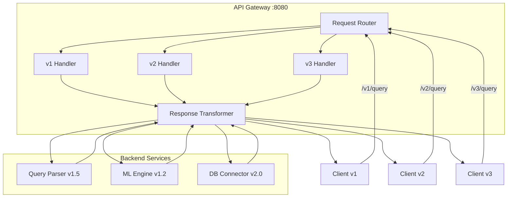

# ChatDB API Versioning & Backward Compatibility Strategy

## 🔄 Versioning Philosophy & Principles

### Core Principles
1. **Consumer-Driven Evolution**: API changes driven by consumer needs, not provider convenience
2. **Backward Compatibility First**: Maintain compatibility for at least 2 major versions
3. **Semantic Versioning**: Follow semver principles adapted for API design
4. **Graceful Degradation**: Older clients should continue working with reduced functionality
5. **Clear Migration Path**: Always provide clear upgrade paths with timeline

### API Lifecycle Management
```
Development → Alpha → Beta → Stable → Deprecated → Sunset
     ↓         ↓       ↓       ↓         ↓         ↓
   Internal   Limited Public  Full     Legacy    Removed
   Testing    Testing Release Support  Support
```

## 📋 Versioning Strategy Overview

### Multi-Service Versioning Matrix
```
Service                | Current | Next    | Legacy Support
----------------------|---------|---------|---------------
API Gateway           | v2.1    | v3.0    | v1.x until Q2'26
Query Parser          | v1.5    | v2.0    | v1.0-v1.4 until Q1'26  
ML Engine             | v1.2    | v1.3    | v1.0-v1.1 until Q3'25
DB Connector          | v2.0    | v2.1    | v1.x until Q4'25
Prediction Service    | v1.1    | v1.2    | v1.0 until Q2'25
Training Orchestrator | v1.3    | v2.0    | v1.0-v1.2 until Q1'26
Model Registry        | v1.4    | v1.5    | v1.0-v1.3 until Q3'25
```

## 🏗️ API Gateway Versioning Architecture

### 1. Version Routing Strategy


### 2. Version Detection Methods
```yaml
Version_Detection_Priority:
  
  1_Header: # Highest priority
    header: "X-API-Version"
    example: "X-API-Version: v2.1"
    fallback: "Accept: application/vnd.chatdb.v2+json"
    
  2_URL_Path: # Path-based versioning
    pattern: "/v{version}/endpoint"
    example: "/v2/query"
    regex: "^/v([0-9]+(?:\.[0-9]+)?)/.*"
    
  3_Query_Parameter: # Query parameter
    parameter: "version"
    example: "/query?version=2.1"
    validation: "semver_pattern"
    
  4_Content_Negotiation: # Accept header
    header: "Accept"
    example: "Accept: application/vnd.chatdb.v2+json"
    default: "latest_stable"
    
  5_Default: # No version specified
    behavior: "latest_stable"
    warning_header: "X-API-Version-Used"
```

### 3. API Gateway Version Handler
```python
from enum import Enum
from dataclasses import dataclass
from typing import Optional, Dict, Any

class APIVersion(Enum):
    V1_0 = "1.0"
    V1_5 = "1.5" 
    V2_0 = "2.0"
    V2_1 = "2.1"
    V3_0 = "3.0"  # Future version

@dataclass
class VersionInfo:
    version: APIVersion
    status: str  # "stable", "deprecated", "beta", "alpha"
    sunset_date: Optional[str]
    migration_guide_url: str
    breaking_changes: List[str]

class APIVersionManager:
    """Central API version management"""
    
    def __init__(self):
        self.supported_versions = {
            APIVersion.V1_0: VersionInfo(
                version=APIVersion.V1_0,
                status="deprecated",
                sunset_date="2026-06-01",
                migration_guide_url="/docs/migration/v1-to-v2",
                breaking_changes=["query_format_changed", "auth_method_updated"]
            ),
            APIVersion.V2_0: VersionInfo(
                version=APIVersion.V2_0,
                status="stable", 
                sunset_date=None,
                migration_guide_url="/docs/api/v2",
                breaking_changes=[]
            ),
            APIVersion.V2_1: VersionInfo(
                version=APIVersion.V2_1,
                status="stable",
                sunset_date=None, 
                migration_guide_url="/docs/api/v2.1",
                breaking_changes=[]
            )
        }
        
    def detect_version(self, request) -> APIVersion:
        """Detect API version from request"""
        
        # 1. Check X-API-Version header
        if version_header := request.headers.get("X-API-Version"):
            return self._parse_version(version_header)
            
        # 2. Check URL path
        if match := re.match(r'^/v([0-9]+(?:\.[0-9]+)?)/.*', request.path):
            return self._parse_version(match.group(1))
            
        # 3. Check query parameter
        if version_param := request.query_params.get("version"):
            return self._parse_version(version_param)
            
        # 4. Check Accept header
        accept_header = request.headers.get("Accept", "")
        if "vnd.chatdb.v" in accept_header:
            version_match = re.search(r'vnd\.chatdb\.v([0-9]+(?:\.[0-9]+)?)', accept_header)
            if version_match:
                return self._parse_version(version_match.group(1))
                
        # 5. Default to latest stable
        return APIVersion.V2_1
        
    def get_handler(self, version: APIVersion, endpoint: str):
        """Get the appropriate handler for version and endpoint"""
        
        handler_mapping = {
            (APIVersion.V1_0, "query"): self.handle_v1_query,
            (APIVersion.V2_0, "query"): self.handle_v2_query,
            (APIVersion.V2_1, "query"): self.handle_v2_1_query,
        }
        
        return handler_mapping.get((version, endpoint))
        
    async def transform_response(self, response: Dict[Any, Any], 
                                target_version: APIVersion) -> Dict[Any, Any]:
        """Transform response format for target version"""
        
        if target_version == APIVersion.V1_0:
            return self._transform_to_v1_format(response)
        elif target_version in [APIVersion.V2_0, APIVersion.V2_1]:
            return self._transform_to_v2_format(response)
            
        return response
```

## 📊 Service-Specific Versioning Strategies

### 1. Query Parser API Evolution
```yaml
Query_Parser_Versions:
  
  v1.0: # Legacy - Simple text parsing
    endpoints:
      - POST /parse
    request_format: |
      {
        "query": "string"
      }
    response_format: |
      {
        "sql": "string",
        "confidence": "number"
      }
    status: "deprecated"
    sunset: "2026-01-01"
    
  v1.5: # Current - Enhanced parsing with context
    endpoints:
      - POST /parse
      - POST /parse/batch
    request_format: |
      {
        "query": "string",
        "context": {
          "user_id": "string",
          "database_schema": "object"
        }
      }
    response_format: |
      {
        "sql": "string", 
        "confidence": "number",
        "intent": "string",
        "entities": "array"
      }
    status: "stable"
    
  v2.0: # Future - Multi-modal parsing
    endpoints:
      - POST /parse
      - POST /parse/batch
      - POST /parse/voice
    request_format: |
      {
        "input": {
          "text": "string",
          "voice": "base64", # New
          "context": "object"
        }
      }
    response_format: |
      {
        "query": {
          "sql": "string",
          "confidence": "number", 
          "alternatives": "array" # New
        },
        "metadata": {
          "processing_time": "number",
          "model_version": "string"
        }
      }
    status: "development"
```

### 2. ML Engine API Evolution  
```yaml
ML_Engine_Versions:
  
  v1.0: # Initial - Basic training
    endpoints:
      - POST /train
      - GET /models/{id}
    breaking_changes_from_v1_0: []
    
  v1.2: # Current - Advanced training with hyperparameter tuning
    endpoints:
      - POST /train
      - POST /train/hyperparameter-search
      - GET /models/{id}
      - GET /models/{id}/metrics
    new_features: ["hyperparameter_search", "detailed_metrics"]
    breaking_changes_from_v1_0: ["metrics_format_changed"]
    
  v1.3: # Next - Distributed training support  
    endpoints:
      - POST /train
      - POST /train/distributed
      - POST /train/hyperparameter-search
      - GET /models/{id}
      - GET /models/{id}/metrics
      - GET /training/{id}/logs
    new_features: ["distributed_training", "training_logs"]
    breaking_changes_from_v1_2: []
```

### 3. Database Connector Evolution
```yaml
DB_Connector_Versions:
  
  v1.0: # Legacy - PostgreSQL only
    supported_databases: ["postgresql"]
    endpoints:
      - POST /execute
    status: "deprecated"
    
  v2.0: # Current - Multi-database support
    supported_databases: ["postgresql", "mysql", "mongodb"] 
    endpoints:
      - POST /execute
      - GET /schema/{database}
      - POST /execute/batch
    breaking_changes_from_v1_0: ["request_format", "authentication"]
    
  v2.1: # Next - Query optimization
    supported_databases: ["postgresql", "mysql", "mongodb", "redis"]
    endpoints:
      - POST /execute
      - POST /execute/optimized # New
      - GET /schema/{database}  
      - POST /execute/batch
      - GET /query/{id}/explain # New
    new_features: ["query_optimization", "execution_plans"]
```

## 🔄 Backward Compatibility Strategies

### 1. Schema Evolution Patterns
```python
from typing import Union, Optional
from pydantic import BaseModel, Field, validator

# v1.0 Schema (Legacy)
class QueryRequestV1(BaseModel):
    query: str

class QueryResponseV1(BaseModel):
    sql: str
    confidence: float

# v2.0 Schema (Current)  
class QueryContextV2(BaseModel):
    user_id: Optional[str] = None
    database_schema: Optional[dict] = None
    preferences: Optional[dict] = None

class QueryRequestV2(BaseModel):
    query: str
    context: Optional[QueryContextV2] = None
    
    @validator('context')
    def set_default_context(cls, v):
        return v or QueryContextV2()

class QueryResponseV2(BaseModel):
    sql: str
    confidence: float
    intent: Optional[str] = None
    entities: Optional[list] = []
    
    # Backward compatibility method
    def to_v1_response(self) -> QueryResponseV1:
        return QueryResponseV1(
            sql=self.sql,
            confidence=self.confidence
        )

# Schema Adapter
class SchemaAdapter:
    """Handle schema transformations between versions"""
    
    def adapt_request(self, data: dict, from_version: str, to_version: str) -> dict:
        """Adapt request data between versions"""
        
        if from_version == "1.0" and to_version == "2.0":
            return self._v1_to_v2_request(data)
        elif from_version == "2.0" and to_version == "1.0":
            return self._v2_to_v1_request(data)
            
        return data
        
    def _v1_to_v2_request(self, v1_data: dict) -> dict:
        """Transform v1 request to v2 format"""
        return {
            "query": v1_data["query"],
            "context": {
                "user_id": None,
                "database_schema": None
            }
        }
        
    def adapt_response(self, data: dict, from_version: str, to_version: str) -> dict:
        """Adapt response data between versions"""
        
        if from_version == "2.0" and to_version == "1.0":
            return {
                "sql": data["sql"],
                "confidence": data["confidence"]
                # Remove v2-specific fields
            }
            
        return data
```

### 2. Database Schema Migration Strategy
```sql
-- Migration versioning table
CREATE TABLE schema_migrations (
    id SERIAL PRIMARY KEY,
    version VARCHAR(20) NOT NULL UNIQUE,
    description TEXT,
    applied_at TIMESTAMP DEFAULT CURRENT_TIMESTAMP,
    rollback_sql TEXT
);

-- v1.0 to v2.0 migration
-- File: migrations/v2.0/001_add_context_support.sql
BEGIN;

-- Add new columns with defaults for backward compatibility
ALTER TABLE training_jobs 
ADD COLUMN context JSONB DEFAULT '{}',
ADD COLUMN created_by VARCHAR(100) DEFAULT 'system',
ADD COLUMN tags TEXT[] DEFAULT '{}';

-- Create new indices
CREATE INDEX idx_training_jobs_created_by ON training_jobs(created_by);
CREATE INDEX idx_training_jobs_tags ON training_jobs USING GIN(tags);

-- Update views for backward compatibility
CREATE OR REPLACE VIEW training_jobs_v1 AS
SELECT 
    id,
    model_name,
    dataset_location,
    status,
    cpu_request,
    created_at,
    updated_at
FROM training_jobs;

-- Add migration record
INSERT INTO schema_migrations (version, description, rollback_sql) VALUES 
('2.0.0', 'Add context support and user tracking', 
 'ALTER TABLE training_jobs DROP COLUMN context, DROP COLUMN created_by, DROP COLUMN tags;');

COMMIT;
```

### 3. Feature Flags for Gradual Rollout
```python
class FeatureFlags:
    """Feature flag management for gradual API rollout"""
    
    def __init__(self):
        self.flags = {
            "v2_query_parsing": {
                "enabled": True,
                "rollout_percentage": 50,
                "user_whitelist": ["user-123", "user-456"],
                "user_blacklist": []
            },
            "v3_voice_input": {
                "enabled": False,
                "rollout_percentage": 0,
                "beta_users_only": True
            },
            "enhanced_security": {
                "enabled": True,
                "rollout_percentage": 100,
                "required_for_versions": ["v2.1", "v3.0"]
            }
        }
        
    def is_enabled(self, flag_name: str, user_context: dict = None) -> bool:
        """Check if feature flag is enabled for user"""
        
        flag = self.flags.get(flag_name, {"enabled": False})
        
        if not flag["enabled"]:
            return False
            
        # Check user whitelist
        user_id = user_context.get("user_id") if user_context else None
        if user_id and user_id in flag.get("user_whitelist", []):
            return True
            
        # Check user blacklist
        if user_id and user_id in flag.get("user_blacklist", []):
            return False
            
        # Check rollout percentage
        rollout_percentage = flag.get("rollout_percentage", 0)
        if user_id:
            # Consistent rollout based on user ID hash
            user_hash = hash(user_id) % 100
            return user_hash < rollout_percentage
            
        return rollout_percentage == 100
```

## 📋 API Documentation Versioning

### 1. OpenAPI Specification Management
```yaml
# openapi-v2.1.yaml
openapi: 3.0.3
info:
  title: ChatDB API
  version: 2.1.0
  description: |
    ChatDB Natural Language Database Interface API
    
    ## Version Information
    - **Current Version**: v2.1 (Stable)
    - **Previous Version**: v2.0 (Stable, supported until 2026-06-01)
    - **Legacy Version**: v1.x (Deprecated, sunset 2026-01-01)
    
    ## Breaking Changes from v2.0
    - None (backward compatible)
    
    ## New Features in v2.1
    - Enhanced query context support
    - Improved error handling
    - Performance optimizations
    
    ## Migration Guide
    See [Migration Guide](/docs/migration/v2.0-to-v2.1) for detailed instructions.
    
  contact:
    name: ChatDB API Support
    url: https://docs.chatdb.com/support
    email: api-support@chatdb.com
    
  license:
    name: MIT
    url: https://opensource.org/licenses/MIT

servers:
  - url: https://api.chatdb.com/v2.1
    description: Production v2.1
  - url: https://api.chatdb.com/v2.0  
    description: Production v2.0 (Legacy support)
  - url: https://staging-api.chatdb.com/v2.1
    description: Staging v2.1

paths:
  /query:
    post:
      summary: Submit natural language query
      description: |
        Convert natural language text to SQL query with confidence scoring.
        
        **Version Notes:**
        - v2.1: Added enhanced context support
        - v2.0: Added context parameter
        - v1.x: Basic text-to-SQL conversion (deprecated)
      operationId: submitQuery
      tags: [Query Processing]
      requestBody:
        required: true
        content:
          application/json:
            schema:
              $ref: '#/components/schemas/QueryRequest'
            examples:
              basic_query:
                summary: Basic query example
                value:
                  query: "Show me all customers from New York"
              contextual_query:
                summary: Query with context
                value:
                  query: "Show me all customers from New York"
                  context:
                    user_id: "user-123"
                    database_schema:
                      tables: ["customers", "orders"]
      responses:
        '200':
          description: Query processed successfully
          content:
            application/json:
              schema:
                $ref: '#/components/schemas/QueryResponse'
        '400':
          $ref: '#/components/responses/BadRequest'
        '429':
          $ref: '#/components/responses/RateLimited'

components:
  schemas:
    QueryRequest:
      type: object
      required: [query]
      properties:
        query:
          type: string
          description: Natural language query text
          example: "Show me all customers from New York"
        context:
          $ref: '#/components/schemas/QueryContext'
          
    QueryContext:
      type: object  
      description: Additional context for query processing
      properties:
        user_id:
          type: string
          description: User identifier for personalized processing
        database_schema:
          type: object
          description: Database schema information
        preferences:
          type: object
          description: User preferences for query processing
          
    QueryResponse:
      type: object
      properties:
        sql:
          type: string
          description: Generated SQL query
        confidence: 
          type: number
          format: float
          minimum: 0
          maximum: 1
          description: Confidence score for the generated query
        intent:
          type: string
          description: Detected query intent
          enum: [SELECT, INSERT, UPDATE, DELETE, AGGREGATE]
        entities:
          type: array
          items:
            type: string
          description: Extracted entities from the query
```

### 2. Documentation Site Structure
```
docs.chatdb.com/
├── api/
│   ├── v2.1/           # Current stable version
│   │   ├── overview.md
│   │   ├── authentication.md
│   │   ├── endpoints/
│   │   └── examples/
│   ├── v2.0/           # Previous stable version  
│   │   └── [same structure]
│   └── v1.x/           # Deprecated versions
│       └── [archived documentation]
├── migration/
│   ├── v1-to-v2.md
│   ├── v2.0-to-v2.1.md
│   └── migration-tools/
├── sdks/
│   ├── python/
│   ├── javascript/
│   └── java/
└── changelog/
    ├── v2.1.0.md
    ├── v2.0.0.md
    └── archive/
```

## 🚦 Deprecation & Sunset Process

### 1. Deprecation Timeline
```yaml
Deprecation_Process:
  
  Phase_1_Announcement: # 12 months before sunset
    duration: "Month 1-2"
    actions:
      - Public announcement in docs and blog
      - Add deprecation headers to API responses
      - Email notification to registered developers
      - Update status pages
      
  Phase_2_Warning: # 6 months before sunset  
    duration: "Month 6-8"
    actions:
      - Increase warning frequency in API responses
      - Dashboard warnings for high-usage clients
      - Direct outreach to major API consumers
      - Migration workshops and office hours
      
  Phase_3_Enforcement: # 3 months before sunset
    duration: "Month 9-11" 
    actions:
      - Rate limiting for deprecated endpoints
      - Forced migration for new API keys
      - Final migration deadline announcements
      - Emergency support contacts established
      
  Phase_4_Sunset: # Version removal
    duration: "Month 12"
    actions:
      - API version disabled
      - Redirect responses with migration info
      - Archive documentation
      - Post-sunset support for critical issues
```

### 2. Client Communication Strategy
```python
class DeprecationManager:
    """Handle API deprecation communications"""
    
    def __init__(self):
        self.deprecation_config = {
            "v1.0": {
                "announced": "2025-06-01",
                "sunset": "2026-06-01", 
                "migration_url": "/docs/migration/v1-to-v2",
                "current_phase": "warning"
            }
        }
        
    def add_deprecation_headers(self, response, version: str):
        """Add deprecation headers to API responses"""
        
        config = self.deprecation_config.get(version)
        if not config:
            return response
            
        headers = {
            "X-API-Deprecated": "true",
            "X-API-Sunset-Date": config["sunset"],
            "X-API-Migration-Guide": config["migration_url"],
            "Link": f'<{config["migration_url"]}>; rel="deprecation"'
        }
        
        # Add warning based on phase
        if config["current_phase"] == "warning":
            headers["Warning"] = f'299 - "Version {version} is deprecated. Please migrate to v2.1 before {config["sunset"]}"'
            
        response.headers.update(headers)
        return response
        
    async def notify_deprecated_api_usage(self, api_key: str, endpoint: str, version: str):
        """Track and notify about deprecated API usage"""
        
        # Log usage for analytics
        await self.log_deprecated_usage(api_key, endpoint, version)
        
        # Check if we should send notification
        usage_count = await self.get_usage_count(api_key, version, timeframe="24h")
        
        if usage_count > 100:  # High usage threshold
            await self.send_migration_notification(api_key, version)
```

## 📊 Version Analytics & Monitoring

### 1. API Version Usage Metrics
```yaml
Version_Metrics:
  
  usage_by_version:
    metric: api_requests_by_version_total
    labels: [version, endpoint, status_code]
    type: counter
    
  version_adoption_rate:
    metric: version_adoption_percentage
    labels: [version, time_period]
    type: gauge
    
  deprecation_violations:
    metric: deprecated_api_usage_total
    labels: [version, api_key, endpoint]
    type: counter
    
  migration_progress:
    metric: client_migration_status
    labels: [api_key, from_version, to_version]
    type: gauge
```

### 2. Migration Analytics Dashboard
```json
{
  "dashboard": {
    "title": "API Version Migration Analytics",
    "panels": [
      {
        "title": "Version Adoption Over Time",
        "type": "graph",
        "targets": [
          {
            "expr": "sum by (version)(rate(api_requests_by_version_total[1h]))",
            "legendFormat": "{{ version }}"
          }
        ]
      },
      {
        "title": "Deprecated API Usage",
        "type": "table",
        "targets": [
          {
            "expr": "topk(10, sum by (api_key)(deprecated_api_usage_total))",
            "format": "table"
          }
        ]
      },
      {
        "title": "Migration Progress", 
        "type": "pie",
        "targets": [
          {
            "expr": "sum by (status)(client_migration_status)"
          }
        ]
      }
    ]
  }
}
```

This comprehensive API versioning strategy ensures smooth evolution of your ChatDB microservices while maintaining backward compatibility and providing clear migration paths for your API consumers.