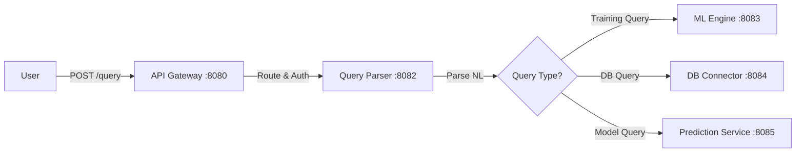
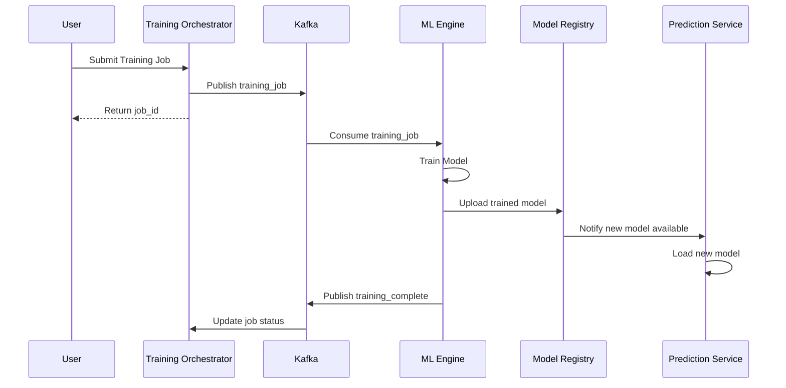
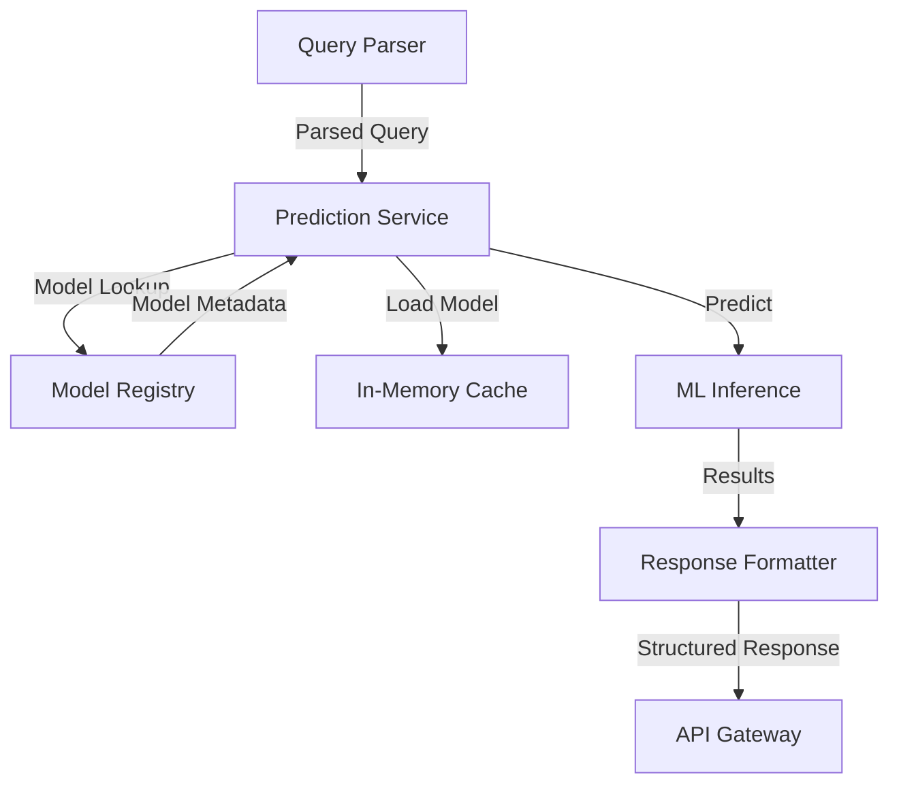
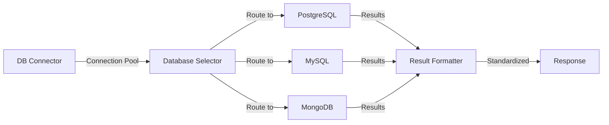
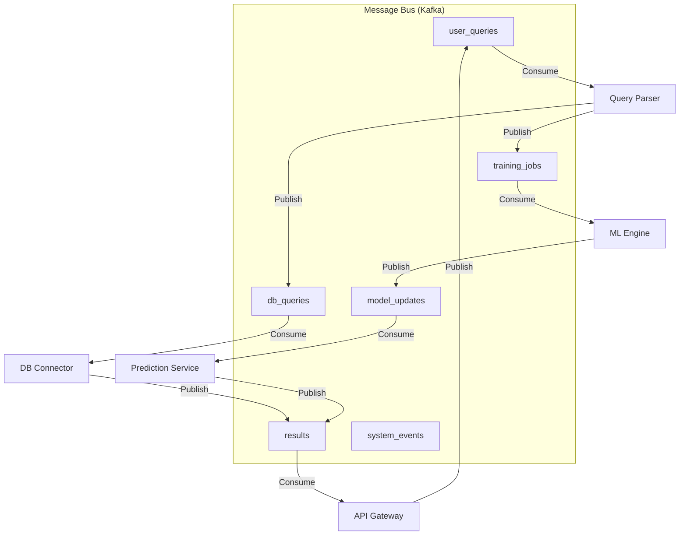
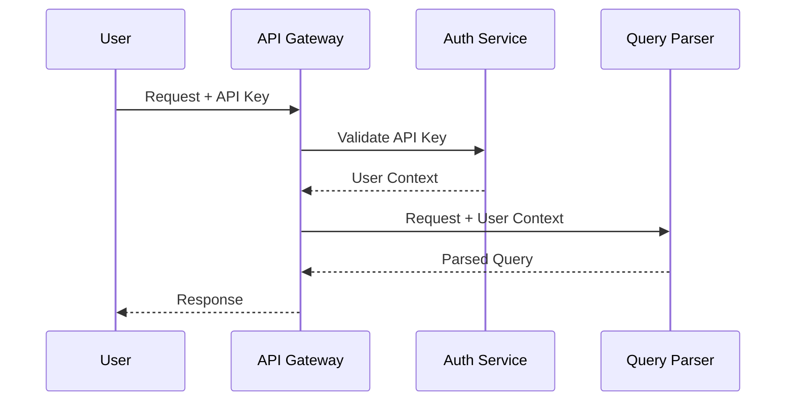

# ChatDB End-to-End Data Flow Integration Design

## 🔄 Complete User Journey Data Flow

### Phase 1: Natural Language Query Processing

```
User Query → API Gateway → Query Parser → ML Engine (if training needed) → DB Connector
```

#### 1.1 Query Reception & Routing


#### 1.2 Data Processing Pipeline
```json
{
  "user_query": {
    "id": "uuid-v4",
    "text": "Show me all customers from New York",
    "user_id": "user-123",
    "timestamp": "2025-08-25T10:00:00Z"
  },
  "parsed_query": {
    "intent": "SELECT",
    "entities": {
      "table": "customers",
      "filters": {"location": "New York"}
    },
    "confidence": 0.95
  },
  "execution_result": {
    "sql": "SELECT * FROM customers WHERE location = 'New York'",
    "rows": 150,
    "execution_time": "0.045s"
  }
}
```

### Phase 2: Model Training Integration

```
Training Request → Training Orchestrator → ML Engine → Model Registry → Prediction Service
```

#### 2.1 Training Job Flow


#### 2.2 Training Job Message Schema
```json
{
  "job_id": "uuid-v4",
  "model_name": "customer_query_classifier",
  "dataset_location": "s3://chatdb/datasets/queries.csv",
  "model_type": "classification",
  "training_config": {
    "epochs": 10,
    "batch_size": 32,
    "learning_rate": 0.001
  },
  "cpu_request": 2,
  "memory_request": "4Gi",
  "gpu_required": false,
  "callback_url": "http://training-orchestrator:8000/jobs/{job_id}/status"
}
```

### Phase 3: Real-time Prediction Integration

```
Query → Prediction Service → Model Registry → Response
```

#### 3.1 Prediction Flow


#### 3.2 Prediction Message Schema
```json
{
  "prediction_request": {
    "id": "uuid-v4",
    "model_id": "customer_query_classifier_v1.2",
    "input_data": {
      "query_text": "Show me sales from last month",
      "user_context": {
        "user_id": "user-123",
        "previous_queries": 5,
        "preferred_db": "sales_db"
      }
    },
    "timestamp": "2025-08-25T10:00:00Z"
  },
  "prediction_response": {
    "prediction_id": "uuid-v4",
    "model_id": "customer_query_classifier_v1.2",
    "results": {
      "intent": "AGGREGATE_SALES",
      "confidence": 0.94,
      "suggested_sql": "SELECT SUM(amount) FROM sales WHERE date >= '2025-07-01'",
      "execution_plan": {
        "database": "sales_db",
        "estimated_rows": 1000,
        "estimated_time": "0.1s"
      }
    },
    "processing_time": "0.025s"
  }
}
```

### Phase 4: Database Connection Integration

```
DB Query → DB Connector → Target Database → Results → Response Formatting
```

#### 4.1 Database Execution Flow


#### 4.2 Database Response Schema
```json
{
  "execution_result": {
    "query_id": "uuid-v4",
    "database_type": "postgresql",
    "connection_id": "conn-123",
    "sql_executed": "SELECT * FROM customers WHERE location = 'New York'",
    "execution_time": "0.045s",
    "rows_affected": 150,
    "columns": [
      {"name": "id", "type": "integer"},
      {"name": "name", "type": "varchar"},
      {"name": "location", "type": "varchar"}
    ],
    "data": [
      {"id": 1, "name": "John Doe", "location": "New York"},
      {"id": 2, "name": "Jane Smith", "location": "New York"}
    ],
    "metadata": {
      "total_rows": 150,
      "page": 1,
      "page_size": 100,
      "has_more": true
    }
  }
}
```

## 🔄 Kafka Message Bus Integration

### Topic Architecture
```yaml
Topics:
  user_queries:
    partitions: 4
    replication: 3
    consumers: [query-parser]
    
  training_jobs:
    partitions: 4  
    replication: 3
    consumers: [ml-engine]
    
  model_updates:
    partitions: 2
    replication: 3
    consumers: [prediction-service]
    
  db_queries:
    partitions: 4
    replication: 3
    consumers: [db-connector]
    
  results:
    partitions: 4
    replication: 3
    consumers: [api-gateway]
    
  system_events:
    partitions: 2
    replication: 3
    consumers: [all-services]
```

### Message Flow Patterns


## 🚦 Circuit Breaker & Resilience Patterns

### Service Health Monitoring
```python
# Health check integration across all services
class ServiceHealthMonitor:
    def __init__(self):
        self.services = {
            'training-orchestrator': 'http://training-orchestrator:8000/health',
            'query-parser': 'http://query-parser:8082/health', 
            'ml-engine': 'http://ml-engine:8083/health',
            'db-connector': 'http://db-connector:8084/health',
            'prediction-service': 'http://prediction-service:8085/health',
            'model-registry': 'http://model-registry:8081/health'
        }
        
    async def check_service_health(self, service_name: str) -> bool:
        # Health check with circuit breaker
        pass
        
    async def cascade_health_check(self) -> Dict[str, bool]:
        # Check all services and dependencies
        pass
```

### Graceful Degradation Strategy
```yaml
Degradation_Levels:
  Level_0: # All services healthy
    features: [full_nl_queries, training, predictions, all_databases]
    
  Level_1: # Training service down
    features: [full_nl_queries, cached_predictions, all_databases]
    disabled: [new_model_training]
    
  Level_2: # ML services down  
    features: [basic_queries, template_queries, all_databases]
    disabled: [nl_parsing, predictions, training]
    
  Level_3: # Database issues
    features: [cached_results, service_health]
    disabled: [live_queries, training, predictions]
    
  Level_4: # Critical failure
    features: [health_status, error_reporting]
    disabled: [all_user_features]
```

## 📊 End-to-End Monitoring Integration

### Distributed Tracing Schema
```json
{
  "trace_id": "trace-uuid",
  "spans": [
    {
      "span_id": "span-1",
      "service": "api-gateway",
      "operation": "receive_query",
      "start_time": "2025-08-25T10:00:00.000Z",
      "duration": "0.002s",
      "tags": {"user_id": "user-123", "query_type": "SELECT"}
    },
    {
      "span_id": "span-2", 
      "parent_span_id": "span-1",
      "service": "query-parser",
      "operation": "parse_natural_language", 
      "start_time": "2025-08-25T10:00:00.002Z",
      "duration": "0.150s",
      "tags": {"confidence": 0.95, "intent": "SELECT"}
    },
    {
      "span_id": "span-3",
      "parent_span_id": "span-2", 
      "service": "db-connector",
      "operation": "execute_query",
      "start_time": "2025-08-25T10:00:00.152Z", 
      "duration": "0.045s",
      "tags": {"database": "postgresql", "rows": 150}
    }
  ],
  "total_duration": "0.197s",
  "status": "success"
}
```

### Performance Metrics Schema
```yaml
Metrics:
  request_latency:
    type: histogram
    labels: [service, operation, status]
    buckets: [0.1, 0.25, 0.5, 1, 2.5, 5, 10]
    
  request_count:
    type: counter
    labels: [service, method, status]
    
  active_connections:
    type: gauge
    labels: [service, database_type]
    
  model_prediction_accuracy:
    type: gauge
    labels: [model_id, model_version]
    
  kafka_message_lag:
    type: gauge
    labels: [topic, partition, consumer_group]
    
  training_job_duration:
    type: histogram
    labels: [model_type, dataset_size]
```

## 🔐 Security Integration Points

### Authentication Flow


### Service-to-Service Authentication
```yaml
Authentication_Method: mTLS
Certificate_Authority: Internal CA
Certificate_Rotation: 30 days
Token_Method: JWT with service identity
Token_Expiration: 1 hour
Refresh_Strategy: Automatic renewal
```

## 🎯 Integration Testing Strategy

### End-to-End Test Scenarios
```python
# Complete integration test
async def test_end_to_end_nl_query():
    # 1. Submit natural language query
    query_response = await client.post("/query", json={
        "text": "Show me customers from New York",
        "user_id": "test-user"
    })
    
    # 2. Verify query parsing
    assert query_response.status_code == 200
    query_id = query_response.json()["query_id"]
    
    # 3. Wait for processing
    await asyncio.sleep(2)
    
    # 4. Check result
    result = await client.get(f"/query/{query_id}/result")
    assert result.json()["status"] == "completed"
    assert len(result.json()["data"]) > 0
    
    # 5. Verify distributed tracing
    trace = await get_trace(query_id)
    assert len(trace["spans"]) >= 3  # Gateway, Parser, DB Connector
```

## 📈 Performance Optimization Integration

### Caching Strategy
```yaml
Cache_Layers:
  L1_Application: # In-memory per service
    - parsed_queries (Query Parser)
    - model_predictions (Prediction Service)  
    - connection_pools (DB Connector)
    
  L2_Distributed: # Redis cluster
    - query_results (30min TTL)
    - model_metadata (24hr TTL)
    - user_preferences (1hr TTL)
    
  L3_Database: # Database-level caching
    - query_plan_cache
    - prepared_statements
    - connection_pooling
```

### Auto-scaling Integration
```yaml
HPA_Configs:
  api-gateway:
    min_replicas: 2
    max_replicas: 10
    cpu_threshold: 70%
    memory_threshold: 80%
    
  query-parser:
    min_replicas: 3
    max_replicas: 15
    custom_metrics: [queue_depth, processing_time]
    
  prediction-service:
    min_replicas: 2  
    max_replicas: 8
    gpu_threshold: 80% # If GPU enabled
    
  db-connector:
    min_replicas: 2
    max_replicas: 6
    connection_pool_threshold: 85%
```

This integration design creates a cohesive, scalable, and resilient natural language database interface that connects all your microservices into a unified system.