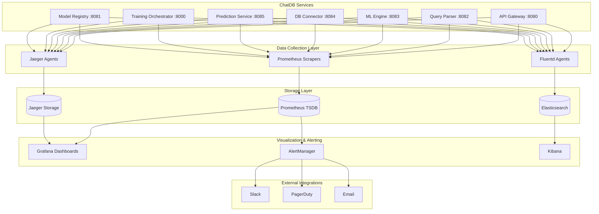

# ChatDB Real-time Monitoring & Alerting System Design

## 📊 Observability Architecture Overview

### Three Pillars of Observability
```
┌─────────────────┬─────────────────┬─────────────────┐
│    METRICS      │      LOGS       │     TRACES      │
├─────────────────┼─────────────────┼─────────────────┤
│ • Prometheus    │ • Fluentd       │ • Jaeger        │
│ • Grafana       │ • Elasticsearch│ • OpenTracing   │
│ • AlertManager  │ • Kibana        │ • Zipkin        │
│ • Custom KPIs   │ • LogQL         │ • Service Map   │
└─────────────────┴─────────────────┴─────────────────┘
```

### Monitoring Stack Architecture


## 📈 Metrics Collection Strategy

### 1. Application Metrics Schema
```yaml
Service_Metrics:
  
  # API Gateway Metrics
  api_gateway:
    request_rate:
      metric: http_requests_total
      labels: [method, endpoint, status_code]
      type: counter
      
    request_duration:
      metric: http_request_duration_seconds
      labels: [method, endpoint]
      type: histogram
      buckets: [0.1, 0.25, 0.5, 1, 2.5, 5, 10]
      
    active_connections:
      metric: http_active_connections
      type: gauge
      
    rate_limit_hits:
      metric: rate_limit_exceeded_total
      labels: [user_id, api_key_tier]
      type: counter

  # Query Parser Metrics
  query_parser:
    query_processing_time:
      metric: query_parse_duration_seconds
      labels: [query_type, complexity]
      type: histogram
      
    parsing_accuracy:
      metric: query_parse_confidence
      labels: [intent_type]
      type: histogram
      
    nlp_model_cache_hits:
      metric: nlp_cache_hits_total
      type: counter
      
    failed_queries:
      metric: query_parse_failures_total
      labels: [failure_reason]
      type: counter

  # ML Engine Metrics  
  ml_engine:
    training_job_duration:
      metric: training_duration_seconds
      labels: [model_type, dataset_size_tier]
      type: histogram
      
    model_accuracy:
      metric: model_validation_accuracy
      labels: [model_id, model_version]
      type: gauge
      
    gpu_utilization:
      metric: gpu_utilization_percent
      labels: [gpu_id]
      type: gauge
      
    training_queue_depth:
      metric: training_queue_jobs
      type: gauge

  # Database Connector Metrics
  db_connector:
    query_execution_time:
      metric: db_query_duration_seconds  
      labels: [database_type, table]
      type: histogram
      
    connection_pool_usage:
      metric: db_connection_pool_active
      labels: [database_type]
      type: gauge
      
    query_cache_efficiency:
      metric: db_query_cache_hit_rate
      labels: [database_type]
      type: gauge
      
    deadlock_count:
      metric: db_deadlocks_total
      labels: [database_type]
      type: counter

  # Prediction Service Metrics
  prediction_service:
    prediction_latency:
      metric: prediction_duration_seconds
      labels: [model_id]
      type: histogram
      
    model_load_time:
      metric: model_load_duration_seconds
      labels: [model_id, model_size]
      type: histogram
      
    cache_hit_rate:
      metric: prediction_cache_hit_rate
      labels: [model_id]
      type: gauge
      
    concurrent_predictions:
      metric: active_predictions
      type: gauge

  # Training Orchestrator Metrics
  training_orchestrator:
    job_queue_size:
      metric: training_jobs_queued
      labels: [priority]
      type: gauge
      
    job_success_rate:
      metric: training_jobs_success_rate
      labels: [model_type]
      type: gauge
      
    resource_utilization:
      metric: training_resource_usage_percent
      labels: [resource_type]
      type: gauge
      
    kafka_lag:
      metric: kafka_consumer_lag
      labels: [topic, partition]
      type: gauge

  # Model Registry Metrics
  model_registry:
    storage_usage:
      metric: model_storage_bytes
      labels: [model_type]
      type: gauge
      
    model_download_rate:
      metric: model_downloads_total
      labels: [model_id]
      type: counter
      
    s3_operation_duration:
      metric: s3_operation_duration_seconds
      labels: [operation_type]
      type: histogram
      
    metadata_query_time:
      metric: metadata_query_duration_seconds
      type: histogram
```

### 2. Infrastructure Metrics
```yaml
Infrastructure_Metrics:
  
  kubernetes:
    pod_cpu_usage:
      metric: container_cpu_usage_seconds_total
      labels: [pod, container, namespace]
      
    pod_memory_usage:
      metric: container_memory_usage_bytes
      labels: [pod, container, namespace]
      
    pod_restart_count:
      metric: kube_pod_container_status_restarts_total
      labels: [pod, container, namespace]
      
    node_capacity:
      metric: kube_node_status_capacity
      labels: [node, resource]

  kafka:
    message_rate:
      metric: kafka_server_brokertopicmetrics_messagesin_total
      labels: [topic]
      
    consumer_lag:
      metric: kafka_consumer_lag_sum
      labels: [consumergroup, topic, partition]
      
    broker_health:
      metric: kafka_server_kafkaserver_brokerstate
      labels: [broker_id]

  postgresql:
    active_connections:
      metric: pg_stat_database_numbackends
      labels: [database]
      
    query_duration:
      metric: pg_stat_statements_mean_time_ms
      labels: [database, query_hash]
      
    buffer_hit_ratio:
      metric: pg_stat_database_blks_hit_ratio
      labels: [database]
```

## 🚨 Alerting System Configuration

### 1. AlertManager Configuration
```yaml
# alertmanager.yml
global:
  smtp_smarthost: 'localhost:587'
  smtp_from: 'chatdb-alerts@company.com'
  slack_api_url: 'https://hooks.slack.com/services/YOUR/SLACK/WEBHOOK'

route:
  group_by: ['alertname', 'cluster', 'service']
  group_wait: 10s
  group_interval: 10s
  repeat_interval: 1h
  receiver: 'chatdb-alerts'
  routes:
  - match:
      severity: critical
    receiver: 'critical-alerts'
    repeat_interval: 5m
  - match:
      severity: warning  
    receiver: 'warning-alerts'
    repeat_interval: 30m

receivers:
- name: 'chatdb-alerts'
  email_configs:
  - to: 'devops@company.com'
    subject: '[ChatDB] {{ .GroupLabels.alertname }}'
    body: |
      {{ range .Alerts }}
      Alert: {{ .Annotations.summary }}
      Description: {{ .Annotations.description }}
      {{ end }}

- name: 'critical-alerts'
  slack_configs:
  - channel: '#chatdb-critical'
    title: 'CRITICAL: {{ .GroupLabels.alertname }}'
    text: |
      {{ range .Alerts }}
      🚨 *Critical Alert*
      *Service:* {{ .Labels.service }}
      *Summary:* {{ .Annotations.summary }}
      *Description:* {{ .Annotations.description }}
      *Runbook:* {{ .Annotations.runbook_url }}
      {{ end }}
  pagerduty_configs:
  - routing_key: 'YOUR_PAGERDUTY_KEY'
    description: '{{ .GroupLabels.alertname }}: {{ .Annotations.summary }}'

- name: 'warning-alerts'
  slack_configs:
  - channel: '#chatdb-warnings'
    title: 'WARNING: {{ .GroupLabels.alertname }}'
    color: 'warning'
```

### 2. Prometheus Alerting Rules
```yaml
# chatdb-alerts.yml  
groups:
- name: chatdb-service-alerts
  rules:
  
  # High Error Rate Alert
  - alert: HighErrorRate
    expr: rate(http_requests_total{status=~"5.."}[5m]) / rate(http_requests_total[5m]) > 0.05
    for: 5m
    labels:
      severity: critical
      service: "{{ $labels.service }}"
    annotations:
      summary: "High error rate detected for {{ $labels.service }}"
      description: "Error rate is {{ $value | humanizePercentage }} for service {{ $labels.service }}"
      runbook_url: "https://wiki.company.com/chatdb/runbooks/high-error-rate"

  # High Response Time Alert  
  - alert: HighResponseTime
    expr: histogram_quantile(0.95, rate(http_request_duration_seconds_bucket[5m])) > 1.0
    for: 10m
    labels:
      severity: warning
      service: "{{ $labels.service }}"
    annotations:
      summary: "High response time for {{ $labels.service }}"
      description: "95th percentile latency is {{ $value }}s for {{ $labels.service }}"

  # Training Job Failure Alert
  - alert: TrainingJobFailures
    expr: increase(training_jobs_failed_total[10m]) > 2
    for: 0m
    labels:
      severity: critical
      service: "ml-engine"
    annotations:
      summary: "Multiple training job failures"
      description: "{{ $value }} training jobs have failed in the last 10 minutes"

  # Database Connection Issues
  - alert: DatabaseConnectionExhausted
    expr: db_connection_pool_active / db_connection_pool_max > 0.9
    for: 5m
    labels:
      severity: warning
      service: "db-connector"
    annotations:
      summary: "Database connection pool nearly exhausted"
      description: "Connection pool usage is at {{ $value | humanizePercentage }}"

  # Kafka Consumer Lag
  - alert: KafkaConsumerLag
    expr: kafka_consumer_lag_sum > 1000
    for: 15m
    labels:
      severity: critical
      service: "kafka"
    annotations:
      summary: "Kafka consumer lag is high"
      description: "Consumer lag is {{ $value }} messages for topic {{ $labels.topic }}"

# TODO(human): Define specific alerting thresholds for your operational requirements
# Configure threshold values for:
# - CPU usage warning/critical levels (suggested: 70%/85%)  
# - Memory usage warning/critical levels (suggested: 75%/90%)
# - Response time thresholds (suggested: 200ms/500ms)
# - Error rate thresholds (suggested: 1%/5%)
# - Business metrics thresholds (training job queue depth, prediction accuracy, etc.)
# Consider your SLA requirements, expected traffic patterns, and operational capacity
```

### 3. Business Logic Alerting
```yaml
- name: chatdb-business-alerts
  rules:
  
  # Model Accuracy Degradation
  - alert: ModelAccuracyDegraded
    expr: model_validation_accuracy < 0.85
    for: 30m
    labels:
      severity: warning
      service: "ml-engine"
    annotations:
      summary: "Model accuracy has degraded"
      description: "Model {{ $labels.model_id }} accuracy is {{ $value | humanizePercentage }}"
      
  # Query Processing Bottleneck  
  - alert: QueryProcessingBottleneck
    expr: query_processing_queue_size > 100
    for: 10m
    labels:
      severity: critical
      service: "query-parser"
    annotations:
      summary: "Query processing queue is backed up"
      description: "{{ $value }} queries are queued for processing"
      
  # Prediction Cache Miss Rate High
  - alert: HighCacheMissRate
    expr: 1 - prediction_cache_hit_rate < 0.7
    for: 15m
    labels:
      severity: warning
      service: "prediction-service" 
    annotations:
      summary: "Prediction cache hit rate is low"
      description: "Cache hit rate is {{ $value | humanizePercentage }}"
```

## 📊 Grafana Dashboard Design

### 1. Executive Summary Dashboard
```json
{
  "dashboard": {
    "title": "ChatDB - Executive Overview",
    "panels": [
      {
        "title": "System Health Score",
        "type": "stat",
        "targets": [
          {
            "expr": "avg(up{job=~\"chatdb-.*\"})",
            "format": "percent"
          }
        ],
        "thresholds": [
          {"color": "red", "value": 0.95},
          {"color": "yellow", "value": 0.98}, 
          {"color": "green", "value": 1.0}
        ]
      },
      {
        "title": "Active Users (Last 24h)",
        "type": "stat", 
        "targets": [
          {
            "expr": "count(count by (user_id)(increase(http_requests_total[24h])))"
          }
        ]
      },
      {
        "title": "Query Success Rate",
        "type": "stat",
        "targets": [
          {
            "expr": "sum(rate(http_requests_total{status=~\"2..\"}[5m])) / sum(rate(http_requests_total[5m]))",
            "format": "percent"
          }
        ]
      },
      {
        "title": "Response Time Trend",
        "type": "graph",
        "targets": [
          {
            "expr": "histogram_quantile(0.50, rate(http_request_duration_seconds_bucket[5m]))",
            "legendFormat": "50th percentile"
          },
          {
            "expr": "histogram_quantile(0.95, rate(http_request_duration_seconds_bucket[5m]))",
            "legendFormat": "95th percentile"  
          }
        ]
      }
    ]
  }
}
```

### 2. Service-Specific Dashboards
```json
{
  "dashboard": {
    "title": "ChatDB - ML Engine Dashboard",
    "panels": [
      {
        "title": "Training Jobs Status",
        "type": "pie",
        "targets": [
          {
            "expr": "sum by (status)(training_jobs_status)"
          }
        ]
      },
      {
        "title": "Model Training Duration",
        "type": "heatmap",
        "targets": [
          {
            "expr": "rate(training_duration_seconds_bucket[5m])"
          }
        ]
      },
      {
        "title": "GPU Utilization",
        "type": "graph",
        "targets": [
          {
            "expr": "gpu_utilization_percent",
            "legendFormat": "GPU {{ $labels.gpu_id }}"
          }
        ]
      },
      {
        "title": "Model Accuracy Over Time",
        "type": "graph", 
        "targets": [
          {
            "expr": "model_validation_accuracy",
            "legendFormat": "{{ $labels.model_id }}"
          }
        ]
      }
    ]
  }
}
```

## 📋 Distributed Tracing Implementation

### 1. Jaeger Trace Schema
```json
{
  "trace_id": "a1b2c3d4e5f6g7h8",
  "spans": [
    {
      "span_id": "span-001",
      "operation_name": "http_request",
      "service_name": "api-gateway",
      "start_time": "2025-08-25T10:00:00.000Z",
      "duration": "0.250s",
      "tags": {
        "http.method": "POST",
        "http.url": "/query",
        "user.id": "user-123",
        "span.kind": "server"
      },
      "logs": [
        {
          "timestamp": "2025-08-25T10:00:00.050Z",
          "fields": {
            "level": "info",
            "message": "Request validated",
            "user_tier": "premium"
          }
        }
      ]
    },
    {
      "span_id": "span-002", 
      "parent_span_id": "span-001",
      "operation_name": "parse_query",
      "service_name": "query-parser",
      "start_time": "2025-08-25T10:00:00.002Z",
      "duration": "0.150s",
      "tags": {
        "query.type": "SELECT",
        "query.complexity": "medium",
        "model.confidence": 0.95
      }
    },
    {
      "span_id": "span-003",
      "parent_span_id": "span-002", 
      "operation_name": "execute_query",
      "service_name": "db-connector",
      "start_time": "2025-08-25T10:00:00.152Z",
      "duration": "0.045s",
      "tags": {
        "database.type": "postgresql",
        "database.name": "chatdb",
        "query.rows_returned": 150
      }
    }
  ]
}
```

### 2. Custom Tracing Implementation
```python
from opentracing import tracer
import time

class TracingMiddleware:
    """Custom tracing middleware for ChatDB services"""
    
    def __init__(self, service_name: str):
        self.service_name = service_name
        
    async def trace_request(self, operation_name: str, request_context: dict):
        """Create and manage distributed traces"""
        
        with tracer.start_span(operation_name) as span:
            # Add standard tags
            span.set_tag('service.name', self.service_name)
            span.set_tag('service.version', os.getenv('SERVICE_VERSION', 'unknown'))
            
            # Add request-specific tags
            for key, value in request_context.items():
                span.set_tag(f'request.{key}', value)
                
            # Add custom business logic tags
            if 'user_id' in request_context:
                span.set_tag('user.id', request_context['user_id'])
                
            start_time = time.time()
            
            try:
                # Execute the operation
                result = yield
                
                # Log success
                span.log_kv({
                    'level': 'info',
                    'message': 'Operation completed successfully',
                    'result_size': len(str(result)) if result else 0
                })
                
                span.set_tag('success', True)
                return result
                
            except Exception as e:
                # Log error
                span.log_kv({
                    'level': 'error', 
                    'message': str(e),
                    'error.kind': type(e).__name__
                })
                
                span.set_tag('error', True)
                span.set_tag('error.message', str(e))
                raise
                
            finally:
                # Record duration
                duration = time.time() - start_time
                span.set_tag('duration_seconds', duration)
```

## 🔔 Notification Channels & Escalation

### 1. Escalation Policy
```yaml
Escalation_Matrix:
  
  Level_1_Warning:
    channels: [slack_warnings]
    escalation_time: "30 minutes"
    auto_resolve: true
    
  Level_2_Critical:
    channels: [slack_critical, email_oncall]
    escalation_time: "10 minutes"
    next_level: "Level_3_Emergency"
    
  Level_3_Emergency:
    channels: [pagerduty, phone_call, slack_critical]
    escalation_time: "5 minutes" 
    executive_notification: true
    
  Level_4_Incident:
    channels: [all_channels, incident_room]
    escalation_time: "immediate"
    incident_commander_assigned: true
```

### 2. Smart Alerting Logic
```python
class SmartAlertingEngine:
    """Intelligent alerting with noise reduction"""
    
    def __init__(self):
        self.alert_history = {}
        self.correlation_rules = {}
        
    async def process_alert(self, alert: Alert) -> bool:
        """Process alert with intelligence"""
        
        # 1. Check for alert fatigue
        if self.is_alert_fatigued(alert):
            return False
            
        # 2. Correlate with other alerts
        correlated_alerts = self.find_correlated_alerts(alert)
        
        if correlated_alerts:
            # Create incident from multiple alerts
            incident = self.create_incident(alert, correlated_alerts)
            await self.send_incident_notification(incident)
        else:
            # Send individual alert
            await self.send_alert_notification(alert)
            
        # 3. Update alert history
        self.update_alert_history(alert)
        
        return True
        
    def is_alert_fatigued(self, alert: Alert) -> bool:
        """Check if we're sending too many similar alerts"""
        
        similar_alerts = [
            a for a in self.alert_history.get(alert.fingerprint, [])
            if a.timestamp > time.time() - 3600  # Last hour
        ]
        
        return len(similar_alerts) > 5  # Max 5 similar alerts per hour
        
    def find_correlated_alerts(self, alert: Alert) -> List[Alert]:
        """Find related alerts that might indicate a larger issue"""
        
        # Look for alerts from the same service or related services
        # within a time window
        
        time_window = 300  # 5 minutes
        now = time.time()
        
        correlated = []
        for other_alert in self.recent_alerts:
            if (other_alert.timestamp > now - time_window and
                self.are_alerts_correlated(alert, other_alert)):
                correlated.append(other_alert)
                
        return correlated
```

## 📊 Performance Monitoring Dashboards

### 1. Real-time Operations Dashboard
```json
{
  "dashboard": {
    "title": "ChatDB - Real-time Operations",
    "refresh": "5s",
    "panels": [
      {
        "title": "Requests per Second",
        "type": "graph",
        "targets": [
          {
            "expr": "sum(rate(http_requests_total[1m])) by (service)",
            "legendFormat": "{{ service }}"
          }
        ]
      },
      {
        "title": "Error Rate %",
        "type": "graph", 
        "targets": [
          {
            "expr": "sum(rate(http_requests_total{status=~\"5..\"}[5m])) by (service) / sum(rate(http_requests_total[5m])) by (service) * 100",
            "legendFormat": "{{ service }}"
          }
        ]
      },
      {
        "title": "Active Training Jobs",
        "type": "stat",
        "targets": [
          {
            "expr": "training_jobs_active"
          }
        ]
      },
      {
        "title": "Database Query Queue",
        "type": "graph",
        "targets": [
          {
            "expr": "db_query_queue_depth",
            "legendFormat": "Queue Depth"
          }
        ]
      }
    ]
  }
}
```

This comprehensive monitoring and alerting system provides full observability into your ChatDB microservices architecture, enabling proactive issue detection and rapid incident response.